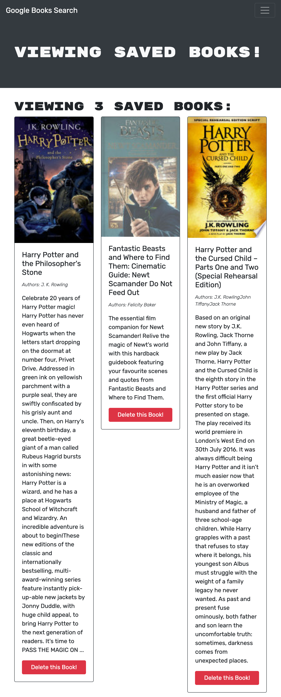
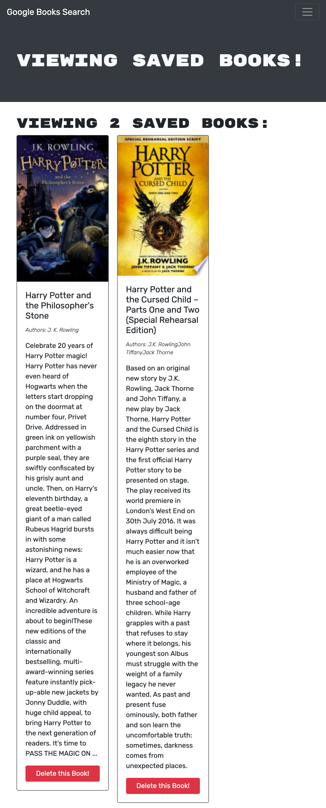

# Book Search Engine Starter Code

## Description

The perfect application for finding and saving particular books! Users have the ablility to search, save, and delete books from their save list. Users will also have to be logged in or sign up to utilize this app!

## Table of Contents

- [Installation](#installation)
- [Usage](#usage)
- [License](#license)
- [Contributing](#contributing)
- [Questions](#questions)

## Installation

Clone this repo using the git clone command! Once cloned, download the necessary dependencies listed in the package.json file. In your server and client directory, start both your local hosts with "npm start."

## Usage

Visit https://ericababb.github.io/react-portfolio/ for the deployed app.

The Search for Books Page:

Users can search any keyword for a list of books: Users can add any book to your save list here.

Saved Books Page:

Here is the list of saved books.

Users have the option to delete any books on your save list.

## License

## Contributing

EricaBabb

## Questions

Github: EricaBabb
Email: ecamilebabb@gmail.com

